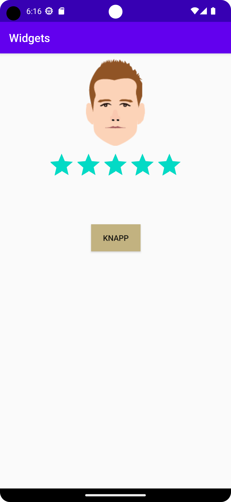
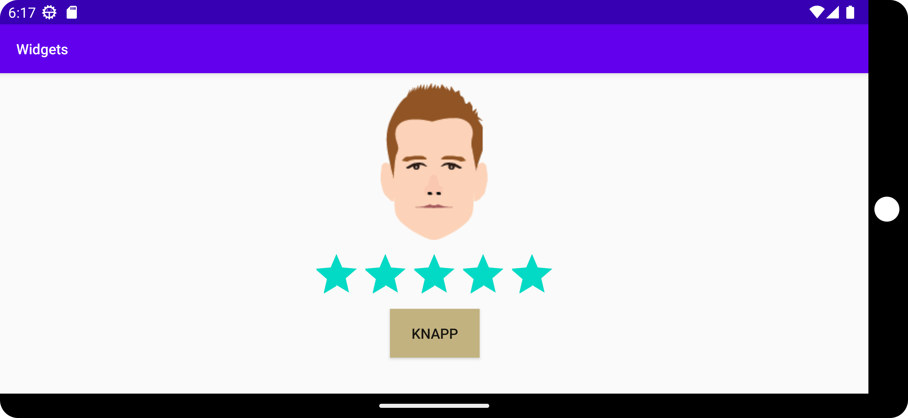

# Rapport

** Appen innehåller ett "constraint" utseende och har tre "widgets" en "ImageView", en "Button" och 
en "RatingBar". Elementen har olika "constaints" och "margins" så att de kan anpassas beroende på
hur man håller mobilen. "ImageView"-elementet innehåller en avatarbild, "button"-elementet har en
bakgrundsfärg av färgen mörk champagne (se Kodsegment och skärmdumpar nedan). **

```
 <Button
        android:id="@+id/button"
        android:layout_width="wrap_content"
        android:layout_height="wrap_content"
        android:layout_marginStart="162dp"
        android:layout_marginLeft="162dp"
        android:layout_marginEnd="161dp"
        android:layout_marginRight="161dp"
        android:layout_marginBottom="30dp"
        android:background="#C2B280"
        android:text="@string/button"
        app:layout_constraintBottom_toBottomOf="parent"
        app:layout_constraintEnd_toEndOf="parent"
        app:layout_constraintHorizontal_bias="0.5"
        app:layout_constraintStart_toStartOf="parent"
        app:layout_constraintTop_toBottomOf="@+id/ratingBar"
        app:layout_constraintVertical_bias="0.156" />

    <ImageView
        android:id="@+id/imageView"
        android:layout_width="wrap_content"
        android:layout_height="wrap_content"
        android:layout_marginTop="10dp"
        android:contentDescription="@string/avatar_text"
        app:layout_constraintEnd_toEndOf="parent"
        app:layout_constraintHorizontal_bias="0.5"
        app:layout_constraintStart_toStartOf="parent"
        app:layout_constraintTop_toTopOf="parent"
        app:srcCompat="@drawable/avatar_test_1" />

    <RatingBar
        android:id="@+id/ratingBar"
        android:layout_width="wrap_content"
        android:layout_height="wrap_content"
        android:layout_marginTop="10dp"
        app:layout_constraintEnd_toEndOf="parent"
        app:layout_constraintHorizontal_bias="0.5"
        app:layout_constraintStart_toStartOf="parent"
        app:layout_constraintTop_toBottomOf="@+id/imageView" />
```



